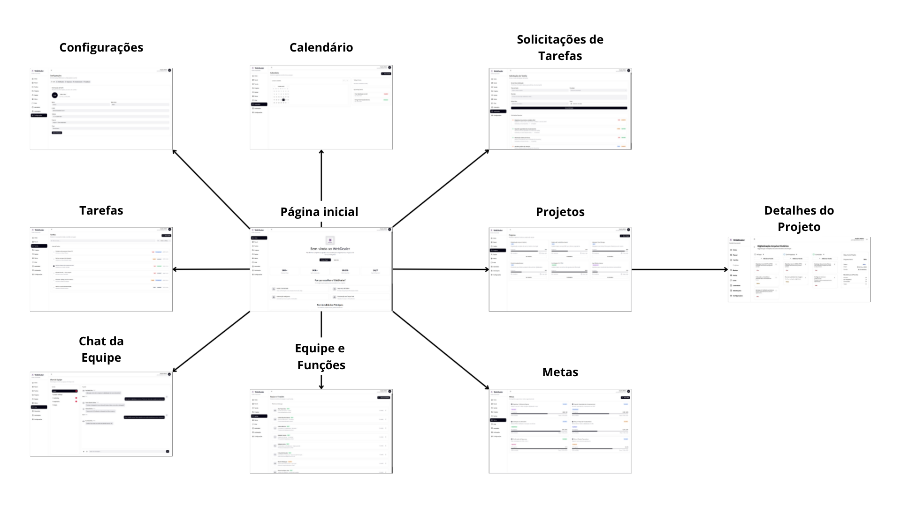
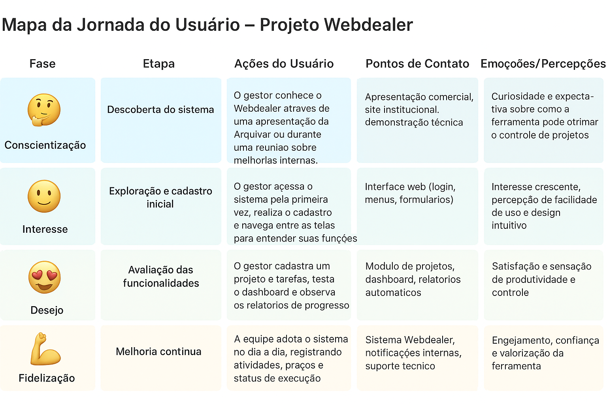

# Projeto de interface

Pré-requisitos: <a href="02-Especificacao.md"> Especificação do projeto</a>

A interface foi projetada para oferecer uma experiência intuitiva e fluida, permitindo que o usuário gerencie processos e projetos de forma simples e eficiente. O sistema coloca o usuário no controle, possibilitando a criação, organização e acompanhamento de atividades de maneira prática, visual e amigável.

 ## User flow

Fluxo de usuário (user flow) é uma técnica que permite ao desenvolvedor mapear todo o fluxo de navegação do usuário na aplicação. Essa técnica serve para alinhar os caminhos e as possíveis ações que o usuário pode realizar junto com os membros da equipe.

### Diagrama de fluxo

O diagrama apresenta o estudo do fluxo de interação do usuário com o sistema interativo, muitas vezes sem a necessidade de desenhar o design das telas da interface. Isso permite que o design das interações seja bem planejado e tenha impacto na qualidade do design do wireframe interativo que será desenvolvido logo em seguida.

O diagrama de fluxo pode ser desenvolvido com “boxes” que possuem, internamente, a indicação dos principais elementos de interface — tais como menus e acessos — e funcionalidades, como editar, pesquisar, filtrar e configurar, além da conexão entre esses boxes a partir do processo de interação.

## Wireframes

São protótipos usados no design de interface para sugerir a estrutura de um site web e seu relacionamento entre suas páginas. Um wireframe web é uma ilustração que mostra o layout dos elementos fundamentais na interface.

## Protótipo interativo

Apresente o protótipo interativo das telas da aplicação, permitindo a navegação simulada pelo sistema. Esse protótipo deve refletir as funcionalidades e interações planejadas, e servir como base para validação com usuários e equipe.  

[Protótipo Interativo - Figma](https://www.figma.com/make/0jE2TzXJ9y1p6pnAbKvBpT/WebDealer---TIAPN?node-id=0-1&p=f&t=zebUSrSR73qQSHnS-0&fullscreen=1)

## Jornada do usuário

# 🧭 Mapa da Jornada do Usuário – Projeto Webdealer

## 📌 Introdução
O mapa da jornada do usuário descreve as etapas percorridas pelos diferentes perfis de usuários durante o uso do sistema **Webdealer**, desde o primeiro contato até a utilização efetiva.  
Essa técnica permite identificar pontos fortes, oportunidades de melhoria e aspectos emocionais que influenciam a experiência do usuário.

O Webdealer é uma aplicação web desenvolvida para a empresa **Arquivar**, com o objetivo de otimizar a **gestão de projetos corporativos**, centralizando informações, organizando tarefas e fornecendo indicadores para a tomada de decisão estratégica.

---

## 🎯 Fases do Modelo AIDA

| **Fase (AIDA)** | **Etapa** | **Ações do Usuário** | **Pontos de Contato** | **Emoções / Percepções** |
|------------------|-----------|----------------------|------------------------|---------------------------|
| **Conscientização** | Descoberta do sistema | O gestor conhece o Webdealer através de uma apresentação da Arquivar ou durante uma reunião sobre melhorias internas. | Apresentação comercial, site institucional, demonstração técnica. | 🤔 Curiosidade e expectativa sobre como a ferramenta pode otimizar o controle de projetos. |
| **Interesse** | Exploração e cadastro inicial | O gestor acessa o sistema pela primeira vez, realiza o cadastro e navega entre as telas para entender suas funções. | Interface web (login, menus, formulários). | 🙂 Interesse crescente, percepção de facilidade de uso e design intuitivo. |
| **Desejo** | Avaliação das funcionalidades | O gestor cadastra um projeto e tarefas, testa o dashboard e observa os relatórios de progresso. | Módulo de projetos, dashboard, relatórios automáticos. | 😃 Confiança e motivação ao perceber a centralização das informações e praticidade. |
| **Ação** | Uso efetivo na rotina | A equipe adota o sistema no dia a dia, registrando atividades, prazos e status de execução. | Sistema Webdealer, notificações internas, suporte técnico. | 😍 Satisfação e sensação de produtividade e controle. |
| **Fidelização (pós-AIDA)** | Melhoria contínua | A empresa integra o Webdealer aos fluxos de trabalho e sugere novas funcionalidades. | Reuniões de feedback, suporte técnico, atualizações do sistema. | 💪 Engajamento, confiança e valorização da ferramenta. |

---

## 💬 Interpretação Técnica

- **Conscientização:** representa o primeiro contato do usuário com o sistema, normalmente motivado pela busca por eficiência.  
- **Interesse:** é a fase de aprendizado e exploração, onde a usabilidade e a clareza da interface são fundamentais.  
- **Desejo:** o momento em que o usuário percebe o valor do Webdealer para seu trabalho.  
- **Ação:** simboliza o uso efetivo e a realização das tarefas dentro do sistema.  
- **Fidelização:** mostra o impacto positivo contínuo, reforçando a adoção e o engajamento da empresa.

---

## 🖼️ Figura – Mapa da Jornada do Usuário

---

## ✅ Conclusão
O mapa da jornada do usuário do **Webdealer** evidencia o papel central da aplicação na transformação digital da empresa **Arquivar**.  
Ao alinhar tecnologia, gestão e experiência do usuário, o sistema se consolida como uma ferramenta estratégica para aumentar a eficiência, a transparência e a colaboração entre equipes.

## Interface do sistema

Apresente **todas as interfaces do sistema**, em sua versão final, descrevendo brevemente a função de cada tela.

Dê ênfase especial às telas relacionadas aos processos BPMN já mapeados e documentados no item <a href="04-Modelagem-processos-negocio.md"> Modelagem dos processos de negócio</a>.

### Tela principal do sistema

Descrição da tela principal do sistema.

> Insira aqui a imagem da tela principal do sistema.

### Telas dos processos BPMN

#### Processo 1

Descrição das telas relativas às atividades do processo 1.

> Inserir imagens das telas correspondentes às atividades do processo 1.

#### Processo 2

Descrição das telas relativas às atividades do processo 2.

> Inserir imagens das telas correspondentes às atividades do processo 2.

### Demais telas do sistema

Apresente e descreva brevemente as demais telas que compõem o sistema, mesmo que não estejam vinculadas diretamente a processos BPMN.

> Inserir imagens das demais telas.
