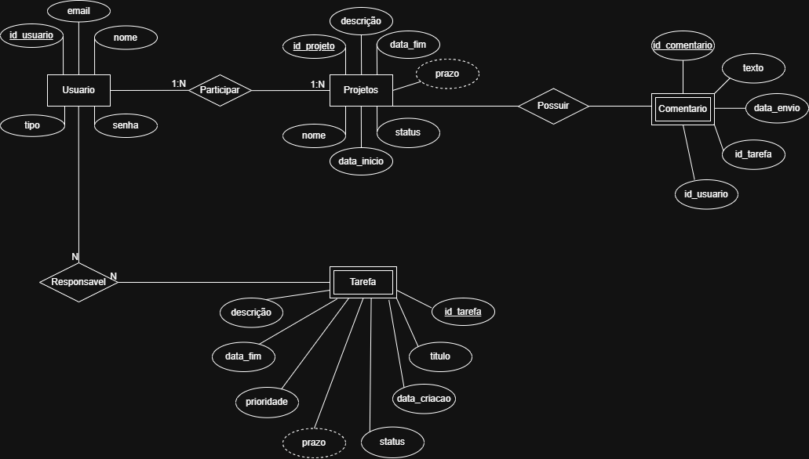

# Arquitetura da solução

<span style="color:red">Pré-requisitos: <a href="05-Projeto-interface.md"> Projeto de interface</a></span>

A arquitetura da solução do WebDealer foi projetada com foco em escalabilidade e organização modular, sendo composta por três camadas principais: Front-end, Back-end e Banco de Dados. Além desses módulos, o sistema conta com hospedagem em nuvem, garantindo maior acessibilidade, desempenho otimizado e disponibilidade contínua da aplicação.


## Diagrama de classes

O diagrama de classes ilustra graficamente a estrutura do software e como cada uma das classes estará interligada. Essas classes servem de modelo para materializar os objetos que serão executados na memória.

Elabore o diagrama de classes utilizando uma ferramenta de modelagem apropriada.

> **Links úteis**:
> - [Diagramas de classes - documentação da IBM](https://www.ibm.com/docs/pt-br/rational-soft-arch/9.7.0?topic=diagrams-class)
> - [O que é um diagrama de classe UML?](https://www.lucidchart.com/pages/pt/o-que-e-diagrama-de-classe-uml)

##  Modelo de dados

O desenvolvimento da solução proposta requer a existência de bases de dados que permitam realizar o cadastro de dados e os controles associados aos processos identificados, assim como suas recuperações.

### Modelo conceitual 

O Diagrama Entidade-Relacionamento (DER), em notação Peter Chen, representa de forma conceitual como as entidades (objetos ou conceitos do minimundo) se relacionam entre si. O DER deve incluir entidades, atributos, relacionamentos, cardinalidade, conforme as regras do minimundo. Deve ser elaborado um único DER que suporte todos os processos mapeados, de modo a garantir uma base de dados integrada. O modelo também deve representar, quando aplicável, o controle de acesso dos usuários (partes interessadas nos processos) de acordo com os papéis definidos nos modelos de processo de negócio.

Elabore o modelo utilizando uma ferramenta de modelagem apropriada.


---

> **Links úteis**:
> - [Notação de Peter Chen para modelagem conceitual de banco de dados](https://www.youtube.com/watch?v=_y31cFi_ByY)
> - [Como fazer um diagrama entidade-relacionamento](https://www.lucidchart.com/pages/pt/como-fazer-um-diagrama-entidade-relacionamento)

### Modelo relacional

O modelo relacional corresponde à representação dos dados, organizando as informações em tabelas (relações) compostas por linhas (tuplas) e colunas (atributos), juntamente com as restrições de integridade, chaves primárias e chaves estrangeiras.

Elabore o modelo utilizando uma ferramenta de modelagem apropriada.


---

> **Links úteis**:
> - [Criando um modelo relacional - documentação da IBM](https://www.ibm.com/docs/pt-br/cognos-analytics/12.0.0?topic=designer-creating-relational-model)
> - [Como fazer um modelo relacional](https://www.youtube.com/watch?v=DWWIREUkxOI)


### Modelo físico

Insira aqui o script de criação das tabelas do banco de dados.

Veja um exemplo:

```sql
CREATE TABLE employees (
    emp_no      INT             NOT NULL,
    birth_date  DATE            NOT NULL,
    first_name  VARCHAR(14)     NOT NULL,
    last_name   VARCHAR(16)     NOT NULL,
    gender      ENUM ('M','F')  NOT NULL,    
    hire_date   DATE            NOT NULL,
    PRIMARY KEY (emp_no)
);

CREATE TABLE departments (
    dept_no     CHAR(4)         NOT NULL,
    dept_name   VARCHAR(40)     NOT NULL,
    PRIMARY KEY (dept_no),
    UNIQUE  KEY (dept_name)
);

CREATE TABLE dept_manager (
   emp_no       INT             NOT NULL,
   dept_no      CHAR(4)         NOT NULL,
   from_date    DATE            NOT NULL,
   to_date      DATE            NOT NULL,
   FOREIGN KEY (emp_no)  REFERENCES employees (emp_no)    ON DELETE CASCADE,
   FOREIGN KEY (dept_no) REFERENCES departments (dept_no) ON DELETE CASCADE,
   PRIMARY KEY (emp_no,dept_no)
); 

CREATE TABLE dept_emp (
    emp_no      INT             NOT NULL,
    dept_no     CHAR(4)         NOT NULL,
    from_date   DATE            NOT NULL,
    to_date     DATE            NOT NULL,
    FOREIGN KEY (emp_no)  REFERENCES employees   (emp_no)  ON DELETE CASCADE,
    FOREIGN KEY (dept_no) REFERENCES departments (dept_no) ON DELETE CASCADE,
    PRIMARY KEY (emp_no,dept_no)
);

CREATE TABLE titles (
    emp_no      INT             NOT NULL,
    title       VARCHAR(50)     NOT NULL,
    from_date   DATE            NOT NULL,
    to_date     DATE,
    FOREIGN KEY (emp_no) REFERENCES employees (emp_no) ON DELETE CASCADE,
    PRIMARY KEY (emp_no,title, from_date)
); 

CREATE TABLE salaries (
    emp_no      INT             NOT NULL,
    salary      INT             NOT NULL,
    from_date   DATE            NOT NULL,
    to_date     DATE            NOT NULL,
    FOREIGN KEY (emp_no) REFERENCES employees (emp_no) ON DELETE CASCADE,
    PRIMARY KEY (emp_no, from_date)
); 

CREATE OR REPLACE VIEW dept_emp_latest_date AS
    SELECT emp_no, MAX(from_date) AS from_date, MAX(to_date) AS to_date
    FROM dept_emp
    GROUP BY emp_no;

-- Shows only the current department for each employee
CREATE OR REPLACE VIEW current_dept_emp AS
    SELECT l.emp_no, dept_no, l.from_date, l.to_date
    FROM dept_emp d
        INNER JOIN dept_emp_latest_date l
        ON d.emp_no=l.emp_no AND d.from_date=l.from_date AND l.to_date = d.to_date;
```
Esse script deverá ser incluído em um arquivo .sql na pasta [de scripts SQL](../src/db).


## Tecnologias

Descreva as tecnologias utilizadas para implementar a solução proposta. Liste todas as tecnologias envolvidas, incluindo linguagens de programação, frameworks, bibliotecas, serviços web, IDEs, ferramentas de apoio e quaisquer outros recursos relevantes para o desenvolvimento.  

Apresente também um diagrama ou figura que ilustre a visão operacional, mostrando como as tecnologias interagem entre si durante o uso do sistema, desde a ação do usuário até a obtenção da resposta.

| **Dimensão**   | **Tecnologia**  |
| ---            | ---             |
| Front-end | HTML5 + CSS + JS |
| Back-end | Node.js |
| Frameworks e Bibliotecas | React + Tailwind + jQuery |
| SGBD | MySQL |
| Autenticação |  |
| Hospedagem / Deploy | Vercel |
| Versionamento | Git + GitHub |
| IDE | Visual Studio Code |


## Hospedagem

Explique como a hospedagem e o lançamento da plataforma foram realizados.

> **Links úteis**:
> - [Website com GitHub Pages](https://pages.github.com/)
> - [Programação colaborativa com Repl.it](https://repl.it/)
> - [Getting started with Heroku](https://devcenter.heroku.com/start)
> - [Publicando seu site no Heroku](http://pythonclub.com.br/publicando-seu-hello-world-no-heroku.html)

## Qualidade de software

Conceituar qualidade é uma tarefa complexa, mas ela pode ser vista como um método gerencial que, por meio de procedimentos disseminados por toda a organização, busca garantir um produto final que satisfaça às expectativas dos stakeholders.

No contexto do desenvolvimento de software, qualidade pode ser entendida como um conjunto de características a serem atendidas, de modo que o produto de software atenda às necessidades de seus usuários. Entretanto, esse nível de satisfação nem sempre é alcançado de forma espontânea, devendo ser continuamente construído. Assim, a qualidade do produto depende fortemente do seu respectivo processo de desenvolvimento.

A norma internacional ISO/IEC 25010, que é uma atualização da ISO/IEC 9126, define oito características e 30 subcaracterísticas de qualidade para produtos de software. Com base nessas características e nas respectivas subcaracterísticas, identifique as subcaracterísticas que sua equipe utilizará como base para nortear o desenvolvimento do projeto de software, considerando alguns aspectos simples de qualidade. Justifique as subcaracterísticas escolhidas pelo time e elenque as métricas que permitirão à equipe avaliar os objetos de interesse.

> **Links úteis**:
> - [ISO/IEC 25010:2011 - Systems and Software Engineering — Systems and Software Quality Requirements and Evaluation (SQuaRE) — System and Software Quality Models](https://www.iso.org/standard/35733.html/)
> - [Análise sobre a ISO 9126 – NBR 13596](https://www.tiespecialistas.com.br/analise-sobre-iso-9126-nbr-13596/)
> - [Qualidade de software - Engenharia de Software](https://www.devmedia.com.br/qualidade-de-software-engenharia-de-software-29/18209)
