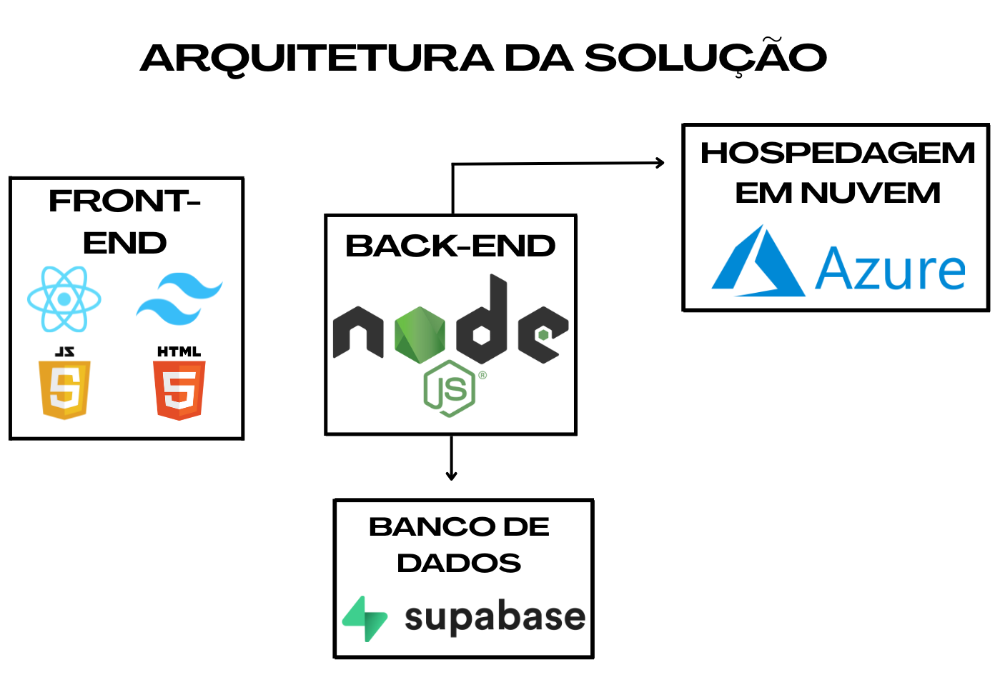

# Arquitetura da solução

<span style="color:red">Pré-requisitos: <a href="05-Projeto-interface.md"> Projeto de interface</a></span>

A arquitetura da solução do WebDealer foi projetada com foco em escalabilidade e organização modular, sendo composta por três camadas principais: Front-end, Back-end e Banco de Dados. Além desses módulos, o sistema conta com hospedagem em nuvem, garantindo maior acessibilidade, desempenho otimizado e disponibilidade contínua da aplicação.



## Diagrama de classes

O diagrama de classes ilustra graficamente a estrutura do software e como cada uma das classes estará interligada. Essas classes servem de modelo para materializar os objetos que serão executados na memória.

Elabore o diagrama de classes utilizando uma ferramenta de modelagem apropriada.

##  Modelo de dados

O desenvolvimento da solução proposta requer a existência de bases de dados que permitam realizar o cadastro de dados e os controles associados aos processos identificados, assim como suas recuperações.

### Modelo conceitual 

O Modelo Entidade-Relacionamento do Webdealer apresenta uma representação conceitual da estrutura de dados do sistema. Ele define as entidades principais, bem como seus respectivos atributos e relacionamentos. O MER abstrai detalhes técnicos e foca na lógica do negócio, sendo fundamental para garantir uma base sólida e coerente na construção do banco de dados, promovendo uma visão clara e estruturada das informações que o sistema irá manipular.


### Modelo relacional

O modelo relacional corresponde à representação dos dados, organizando as informações em tabelas (relações) compostas por linhas (tuplas) e colunas (atributos), juntamente com as restrições de integridade, chaves primárias e chaves estrangeiras.

Elabore o modelo utilizando uma ferramenta de modelagem apropriada.


### Modelo físico

```sql
CREATE TABLE usuario (
  id_usuario UUID PRIMARY KEY,
  nome VARCHAR(100) NOT NULL,
  email VARCHAR(255) UNIQUE NOT NULL,
  senha TEXT NOT NULL,
  tipo tipo_usuario NOT NULL DEFAULT 'colaborador'
);

CREATE TABLE projeto (
  id_projeto UUID PRIMARY KEY,
  nome VARCHAR(150) NOT NULL,
  descricao TEXT,
  data_inicio DATE NOT NULL,
  data_fim DATE,
  status status_projeto NOT NULL DEFAULT 'em_andamento',
  id_criador UUID REFERENCES usuario(id_usuario) ON DELETE SET NULL,
  criado_em TIMESTAMP WITH TIME ZONE DEFAULT NOW()
);

CREATE TABLE participacao (
  id_participacao UUID PRIMARY KEY,
  id_usuario UUID REFERENCES usuario(id_usuario) ON DELETE CASCADE,
  id_projeto UUID REFERENCES projeto(id_projeto) ON DELETE CASCADE,
  cargo VARCHAR(100),
  UNIQUE (id_usuario, id_projeto)
);

CREATE TABLE tarefa (
  id_tarefa UUID PRIMARY KEY,
  titulo VARCHAR(150) NOT NULL,
  descricao TEXT,
  prioridade prioridade_tarefa NOT NULL DEFAULT 'media',
  status status_tarefa NOT NULL DEFAULT 'pendente',
  prazo DATE,
  data_criacao TIMESTAMP WITH TIME ZONE DEFAULT NOW(),
  id_projeto UUID REFERENCES projeto(id_projeto) ON DELETE CASCADE,
  id_responsavel UUID REFERENCES usuario(id_usuario) ON DELETE SET NULL
);

CREATE TABLE comentario (
  id_comentario UUID PRIMARY KEY,
  texto TEXT NOT NULL,
  data_envio TIMESTAMP WITH TIME ZONE DEFAULT NOW(),
  id_tarefa UUID REFERENCES tarefa(id_tarefa) ON DELETE CASCADE,
  id_usuario UUID REFERENCES usuario(id_usuario) ON DELETE CASCADE
);

```
Esse script deverá ser incluído em um arquivo .sql na pasta [de scripts SQL](../src/db).


## Tecnologias

O front-end será desenvolvido utilizando React em conjunto com o Vite, visando a criação de uma aplicação SPA (Single Page Application) moderna e de carregamento otimizado. O layout será estruturado por meio de componentes reutilizáveis e estilizado com Tailwind CSS, framework que oferece produtividade e consistência visual por meio de classes utilitárias. Em pontos específicos da aplicação, será utilizado jQuery para facilitar manipulações pontuais do DOM e aprimorar interações dinâmicas. Todo o ambiente de desenvolvimento será configurado no Visual Studio Code, aproveitando suas extensões e recursos de depuração integrados. 

Na camada de back-end, será utilizada a stack Node.js, responsável pelo processamento das requisições e comunicação entre o front-end e o banco de dados. A API será estruturada de forma modular e escalável, adotando o padrão RESTful para integração eficiente com o cliente. 

O sistema de persistência de dados será implementado com o MySQL, banco relacional amplamente utilizado, que garantirá a integridade e o desempenho das operações de leitura e escrita. A comunicação entre o servidor e o banco será feita através de consultas SQL diretas, priorizando simplicidade e clareza nas interações. 

O versionamento do código será gerenciado pelo Git, com repositório hospedado no GitHub, permitindo controle de histórico, colaboração em equipe e integração com ferramentas de deploy. 

A hospedagem da aplicação será realizada na plataforma Microsoft Azure, que fornecerá os serviços de deploy do back-end e front-end, além da integração com o banco de dados em nuvem. O Azure permitirá o gerenciamento unificado dos recursos do sistema, com escalabilidade automática e monitoramento contínuo de desempenho. 

| **Dimensão**   | **Tecnologia**  |
| ---            | ---             |
| Front-end | HTML5 + CSS + JS |
| Back-end | Node.js |
| Frameworks e Bibliotecas | React + Tailwind + jQuery |
| SGBD | MySQL |
| Autenticação |  |
| Hospedagem / Deploy | Vercel |
| Versionamento | Git + GitHub |
| IDE | Visual Studio Code |


## Hospedagem

Explique como a hospedagem e o lançamento da plataforma foram realizados.

> **Links úteis**:
> - [Website com GitHub Pages](https://pages.github.com/)
> - [Programação colaborativa com Repl.it](https://repl.it/)
> - [Getting started with Heroku](https://devcenter.heroku.com/start)
> - [Publicando seu site no Heroku](http://pythonclub.com.br/publicando-seu-hello-world-no-heroku.html)

## Qualidade de software

Conceituar qualidade é uma tarefa complexa, mas ela pode ser vista como um método gerencial que, por meio de procedimentos disseminados por toda a organização, busca garantir um produto final que satisfaça às expectativas dos stakeholders.

No contexto do desenvolvimento de software, qualidade pode ser entendida como um conjunto de características a serem atendidas, de modo que o produto de software atenda às necessidades de seus usuários. Entretanto, esse nível de satisfação nem sempre é alcançado de forma espontânea, devendo ser continuamente construído. Assim, a qualidade do produto depende fortemente do seu respectivo processo de desenvolvimento.

A norma internacional ISO/IEC 25010, que é uma atualização da ISO/IEC 9126, define oito características e 30 subcaracterísticas de qualidade para produtos de software. Com base nessas características e nas respectivas subcaracterísticas, identifique as subcaracterísticas que sua equipe utilizará como base para nortear o desenvolvimento do projeto de software, considerando alguns aspectos simples de qualidade. Justifique as subcaracterísticas escolhidas pelo time e elenque as métricas que permitirão à equipe avaliar os objetos de interesse.

> **Links úteis**:
> - [ISO/IEC 25010:2011 - Systems and Software Engineering — Systems and Software Quality Requirements and Evaluation (SQuaRE) — System and Software Quality Models](https://www.iso.org/standard/35733.html/)
> - [Análise sobre a ISO 9126 – NBR 13596](https://www.tiespecialistas.com.br/analise-sobre-iso-9126-nbr-13596/)
> - [Qualidade de software - Engenharia de Software](https://www.devmedia.com.br/qualidade-de-software-engenharia-de-software-29/18209)
